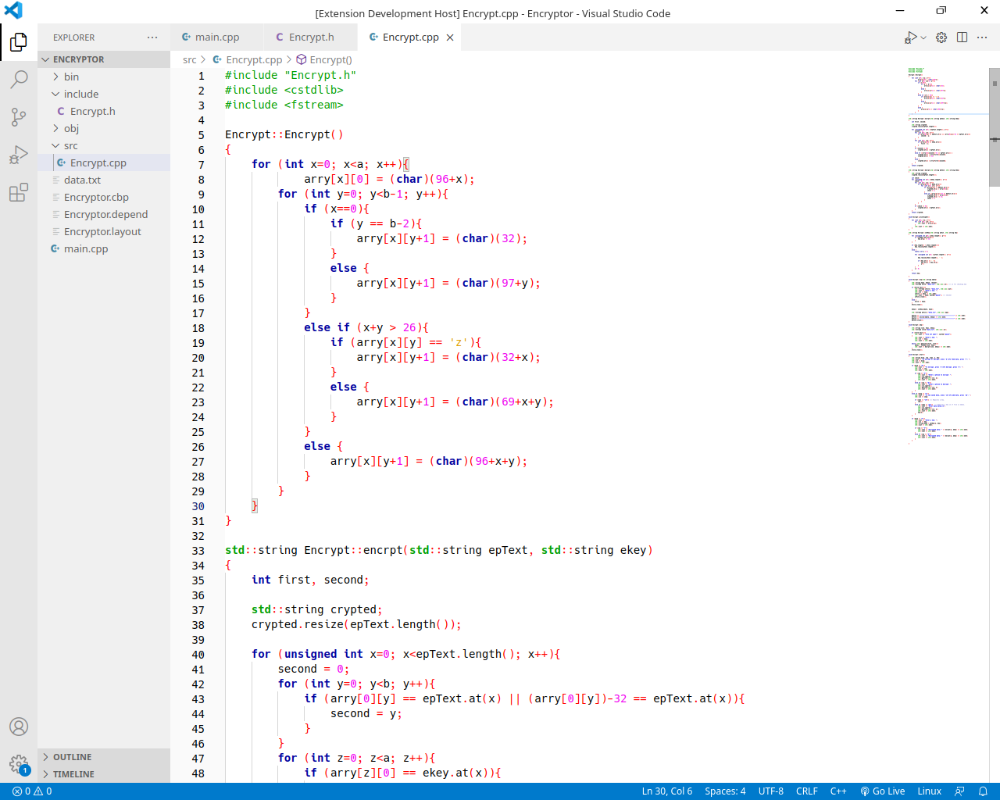

# Code::Blocks color theme

Default Code::Blocks color theme for VS Code.

#### [GitHub Repository](https://github.com/DevShayan/code--blocks-color-theme)&nbsp;&nbsp;|&nbsp;&nbsp;[Report an issue](https://github.com/DevShayan/code--blocks-color-theme/issues)

## Applying theme

### To apply theme:

* Ctrl+Shift+P -> Preferences: Color Theme -> Code::Blocks default

## Preview

**Enjoy!**
